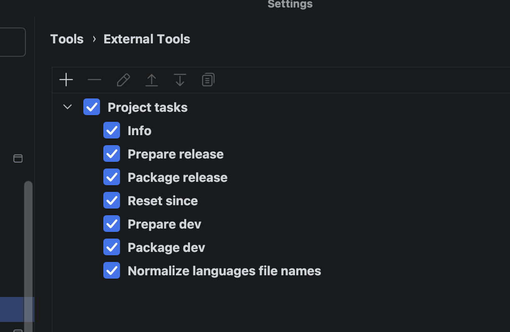
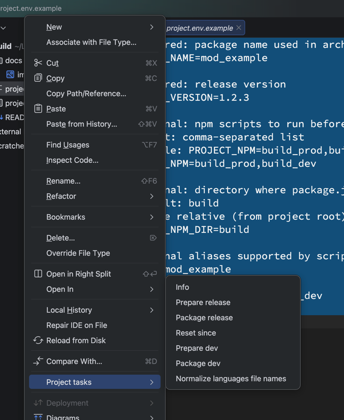

# Project Tasks Bash Tool

A release automation utility tailored for Joomla projects and a PhpStorm-based workflow.

## What It Does

Supported actions:

- `info`
- `prepareRelease`
- `packageRelease`
- `resetSince`
- `prepareDev`
- `normalizeLangFileNames`
- `packageDev`

## Requirements

- `bash`
- `zip`
- `npm` (only if `PROJECT_NPM` is used)
- PhpStorm copyright templates in `.idea/copyright` (required for `prepareDev`)

## Action Details

- `info` - prints project metadata, release/dev versions, package names, and base directory.
- `prepareRelease` - optionally runs npm scripts (if configured), then updates release version/date placeholders in project files.
- `packageRelease` - creates a release ZIP package in `.packages`.
- `resetSince` - resets `@since` tags to `__DEPLOY_VERSION__`.
- `prepareDev` - updates files to dev version/date and updates PhpStorm copyright templates from `.idea/copyright` (required).
- `normalizeLangFileNames` - renames language files like `en-GB.name.ini` to `name.ini`.
- `packageDev` - creates a dev ZIP package in `.packages`.

## Env File Rule

The script reads parameters **only** from the file passed via `--env=...`.

There is no automatic `.env` / `build.env` lookup.

## Env File Format

Use `project.env.example` as a template.

Required parameters:

- `PROJECT_NAME`
- `PROJECT_VERSION`

Optional parameters:

- `PROJECT_NPM` - comma-separated npm scripts, example: `script1,script2`
- `PROJECT_NPM_DIR` - directory containing `package.json`, default: `build`

## Env Example

```env
PROJECT_NAME=mod_example
PROJECT_VERSION=1.2.3
PROJECT_NPM=build_prod,build_dev
PROJECT_NPM_DIR=build
```

## PhpStorm Usage

Primary workflow is running actions through PhpStorm External Tools.

## NPM Behavior in `prepareRelease`

If `PROJECT_NPM` is not set, the npm step is skipped.

If `PROJECT_NPM` is set:

- all scripts are run sequentially;
- on success: `Run npm scripts ... OK (N scripts)`;
- on failure: `Run npm scripts ... ERROR`, plus failed script name and log file path.

## PhpStorm External Tool Setup

Open:

- `Settings` -> `Tools` -> `External Tools` -> `+`

Step 1: External Tools list in PhpStorm settings.



Create an external tool (for example `prepareRelease`):

- `Program`: `/bin/bash`
- `Arguments`: `"/absolute/path/to/project_tasks.sh" --action=prepareRelease --env="$FilePath$"`
- `Working directory`: `$ProjectFileDir$`

Step 2: run the tool from context menu on the selected env file.



Why this setup:

- `--env="$FilePath$"` passes the exact env file you invoked the tool on.
- `Working directory` defines project `Base Directory` for replacements/packaging.

Recommendation:

Create separate External Tools for frequently used actions:

- `info`
- `prepareRelease`
- `prepareDev`
- `normalizeLangFileNames`
- `packageRelease`

Only `--action=...` changes.

Arguments examples:

- `"/absolute/path/to/project_tasks.sh"` is the full path to this script; it can be located anywhere on your machine.
- `--env="$FilePath$"` means the full path to the currently selected env file in PhpStorm; the file can be located in any project subdirectory.
- `"/absolute/path/to/project_tasks.sh" --action=info --env="$FilePath$"`
- `"/absolute/path/to/project_tasks.sh" --action=prepareRelease --env="$FilePath$"`
- `"/absolute/path/to/project_tasks.sh" --action=prepareDev --env="$FilePath$"`
- `"/absolute/path/to/project_tasks.sh" --action=normalizeLangFileNames --env="$FilePath$"`
- `"/absolute/path/to/project_tasks.sh" --action=packageRelease --env="$FilePath$"`

## Common Issues

1. `Error: --env is required...`

- `--env` was not provided.

2. `package.json not found ...`

- check `PROJECT_NPM_DIR`.

3. `npm command not found`

- npm is not available in PhpStorm environment PATH.

4. Slow packaging because of `build/node_modules`

- the script already excludes such directories early via `find -prune`.
